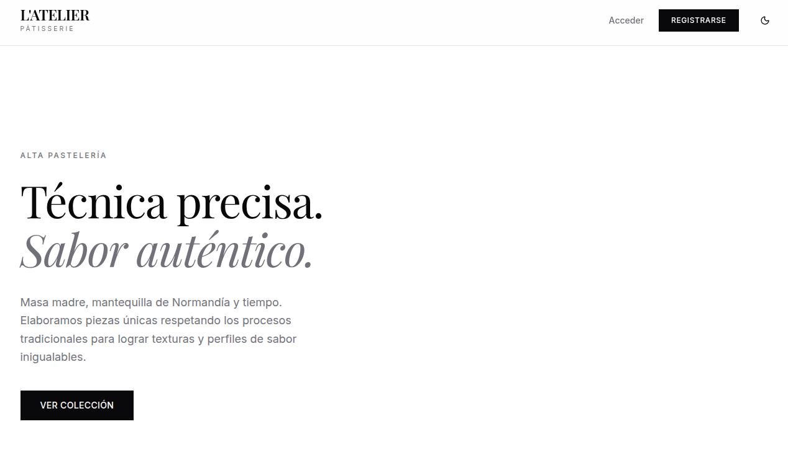
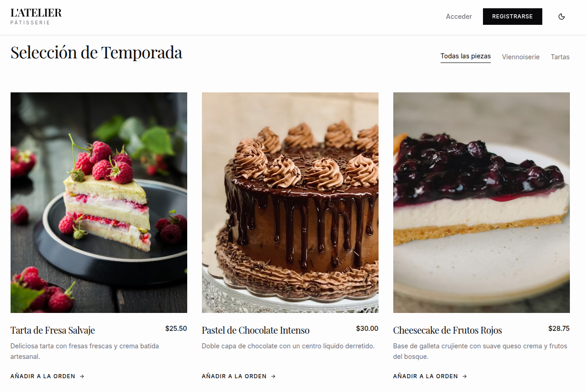
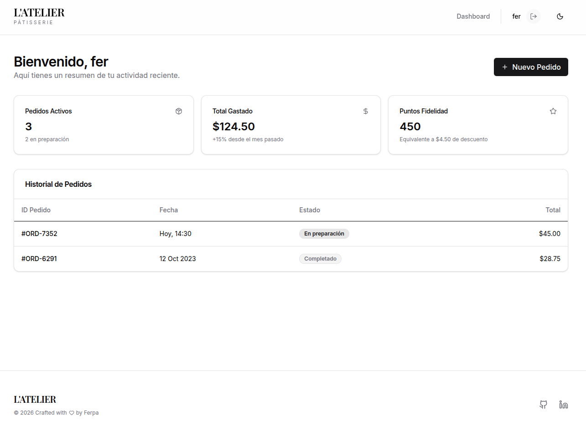

cat << 'EOF' > README.md
# L'Atelier - Alta Pastelería


Una plataforma web moderna y minimalista para la exhibición y gestión de alta repostería. Desarrollada con un enfoque en diseño editorial y una arquitectura de software limpia utilizando Python y Flask.

---

## Vistas Previas

### Inicio y Hero Section
Página de aterrizaje con diseño asimétrico y tipografía contrastante.


### Catálogo de Temporada
Listado de productos con tarjetas interactivas y efecto hover.


### Dashboard Administrativo
Panel de control exclusivo para usuarios autenticados con resumen de métricas.


---

## Características Principales

- **Catálogo Dinámico:** Visualización de productos obtenidos directamente desde la base de datos.
- **Autenticación Segura:** Sistema de Registro y Login encriptado mediante `Werkzeug`.
- **Dashboard Privado:** Panel de métricas y pedidos protegido por `Flask-Login`.
- **Diseño Responsivo & Dark Mode:** Interfaz construida con Tailwind CSS v4, adaptable a cualquier dispositivo y con soporte nativo para modo oscuro/claro.
- **Poblado Automático (Seeding):** La base de datos se inicializa automáticamente con datos de prueba al detectar tablas vacías.

## Stack Tecnológico

- **Backend:** Python 3, Flask
- **Base de Datos:** MySQL (Conector: PyMySQL), Flask-SQLAlchemy, Flask-Migrate
- **Frontend:** HTML5, Tailwind CSS v4 (Play CDN), Lucide Icons
- **Gestor de Dependencias:** Pip / Virtualenv

---

## Instalación y Uso Local

Sigue estos pasos para desplegar el proyecto en tu entorno local.

### 1. Clonar el repositorio
```bash
git clone https://github.com/fernixp/reposteria-app.git
cd reposteria-app
```

### 2. Configurar el Entorno Virtual
Es altamente recomendado utilizar un entorno virtual para aislar las dependencias.
```bash
python3 -m venv venv
source venv/bin/activate
```

### 3. Instalar Dependencias
```bash
pip install -r requirements.txt
```

### 4. Configurar la Base de Datos
Asegúrate de tener un servidor MySQL corriendo (el proyecto está configurado para el puerto 3307). Crea una base de datos vacía llamada reposteria.
```sql
CREATE DATABASE reposteria;
```

*Nota: Puedes ajustar las credenciales (usuario, contraseña y puerto) en el archivo app/config.py.*

### 5. Iniciar la Aplicación
Al ejecutar el proyecto por primera vez, las tablas se crearán y se llenarán automáticamente con pasteles de prueba.
```bash
python run.py
```

La aplicación estará disponible en http://127.0.0.1:5000/

---

## Estructura del Proyecto

```text
reposteria-app/
├── app/
│   ├── templates/          # Vistas HTML (Jinja2)
│   ├── __init__.py         # Application Factory pattern
│   ├── auth.py             # Rutas y lógica de autenticación (Blueprints)
│   ├── config.py           # Variables de configuración y conexión DB
│   ├── extensions.py       # Instanciación de extensiones Flask
│   └── models.py           # Modelos de SQLAlchemy (User, Pastel)
├── docs/                   # Documentación y capturas
├── run.py                  # Punto de entrada de la aplicación
└── README.md
```

---

## Autor
Crafted with ❤️ by **Ferpa**. 
- [GitHub](https://github.com/fernixp)
- [LinkedIn](https://www.linkedin.com/in/fernando-nina-inc/)
EOF